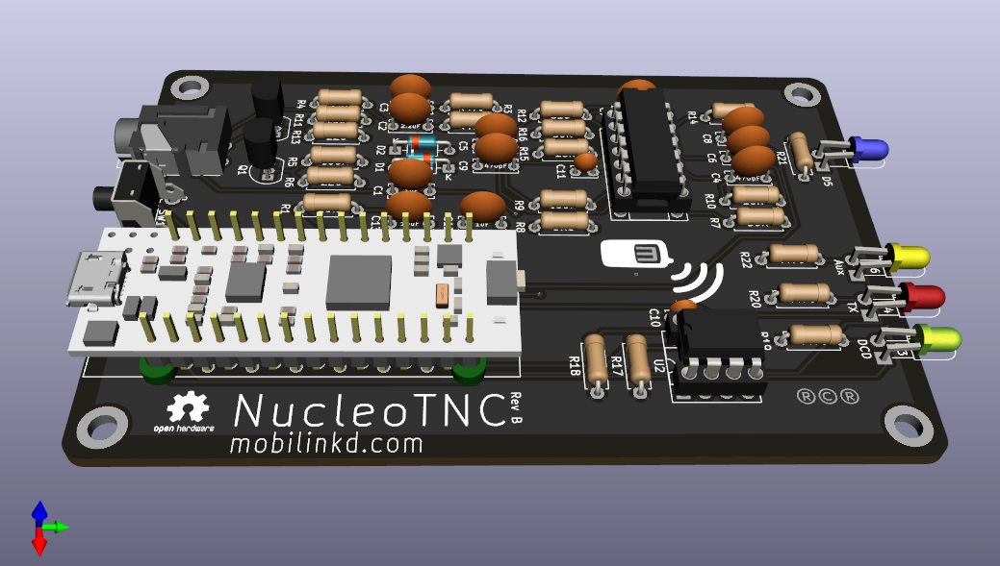
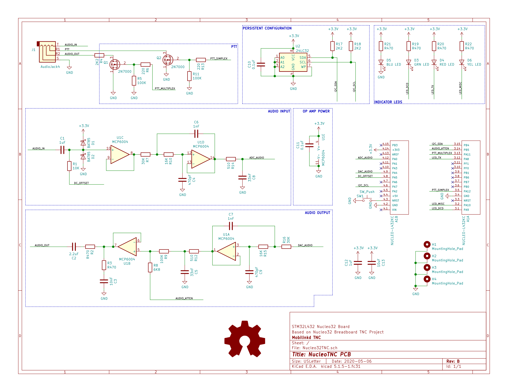

# NucleoTNC PCB

This work is licensed under a
<a rel="license" href="http://creativecommons.org/licenses/by-sa/4.0/">
Creative Commons Attribution-ShareAlike 4.0 International License</a>.
 

Please attribute the work to *Rob Riggs, WX9O, Mobilinkd LLC*.

This directory contains the KiCAD files for the Nucleo TNC printed circuit
board (PCB).  This is a PCB for the [NucleoTNC breadboard project](http://www.mobilinkd.com/2019/06/24/nucleotnc/).

The design goal is to allow experimenters to take their breadboard project
and give it a more permanent home on a real printed circuit board.

This PCB is designed to fit in the [enclosure](../../Enclosure/README.md) that is
also available in this repository.

Please refer to the [NucleoTNC breadboard project](https://nbviewer.jupyter.org/github/mobilinkd/NucleoTNC/blob/master/Build/NucleoTNC.ipynb)
project for in-depth discussion of the design and theory of operation.  We are
only going to cover briefly the design differences below, then provide the full
bill of materials (BOM) required to build the TNC.

This repository also contains the open source firmware for the TNC.  The
Mobilinkd project on Github contains numerous other resources, including a
Python-based configuration program.

These PCBs can be purchased directly from the mobilinkd store.

https://store.mobilinkd.com/collections/kits

## Breadboard Differences

This section covers the differences between the NucleoTNC breadboard project
and the PCB version.  The schematic is presented below.

There are a few small differences in design.

The one necessary change was to the 3.5mm jack.  The breadboard module is
inappropriate for a PCB design.  The PCB uses a CUI SJ-43515TS or SJ-43514
jack.  Discovered after this choice was made is that CUI uses the same model
number for both a through-hole component and a surface mount component.  For
this project you will need the through-hole part.

IC sockets for the quad op-amp and EEPROM are recommended.  Insert the ICs
into the sockets rather than soldering these components directly on the PCB.

There are two additional LEDs on the PCB.  One indicates power.  The other
is there as an auxilliary indicator and is currently unused.  These exist
because the power LED and auxilliary LED on the Nucleo32 board are hidden
when the PCB is mounted in an enclosure.  Each require a 470 Ohm resistor.

There is an external reset button.  This is because the reset switch on the
TNC is inaccessible when mounted in an enclosure.  The reset button is a
C&K PTS645VL58-2 LFS.

And there are two additional capacitors on the power plane for added
decoupling.  These are not strictly necessary.

We have changed the input coupling capacitor from 0.22uF to 1uF to improve
the low frequency response of the TNC.  This is now recommended for the
breadboard version as well.

Included in the enclosure components is a spacer PCB.  This can be 3D-printed
rather than made out of FR-4 PCB material.  Two of these are needed to raise
the Nucleo32 board off the PCB so that it will fit in the enclosure properly.
You can see the two spacers in the rendering at the top of the page.

The through-holes for the Nucleo board on the PCB are staggered.  This allows
for a press-fit of the Nucleo board into the PCB for testing.  The Nucleo32 can
be inserted into the PCB and should work without being soldered in.  It will
likely only work for a few insertions.  And the Nucleo board should be soldered
in place before installing it into the enclosure.  If it comes out of the
PCB while power is applied, there is risk of damage to the Nucleo board and
the components on the PCB.

## Bill of Materials

| Manufacturer                         	| Manufacturer Part Number 	| Description                      	| Quantity 	| Unit Price 	| Extended Price 	|
|--------------------------------------	|--------------------------	|----------------------------------	|----------	|------------	|----------------	|
| CUI                               	| SJ-43515TS              	| TRRS 3.5MM JACK THROUGH-HOLE  	| 1        	| 1.08       	| 1.08           	|
| Vishay Semiconductor Diodes Division 	| BAT85S-TAP               	| DIODE SCHOTTKY 30V 200MA DO35    	| 2        	| 0.38       	| 0.76           	|
| STMicroelectronics                   	| NUCLEO-L432KC            	| NUCLEO-32 STM32L432KC EVAL BRD   	| 1        	| 10.99      	| 10.99          	|
| Microchip Technology                 	| MCP6004-I/P              	| IC OPAMP GP 4 CIRCUIT 14DIP      	| 1        	| 0.45       	| 0.45           	|
| Microchip Technology                 	| 24LC32A-I/P              	| IC EEPROM 32K I2C 400KHZ 8DIP    	| 1        	| 0.41       	| 0.41           	|
| Microchip Technology                 	| 2N7000-G                 	| MOSFET N-CH 60V 0.2A TO92-3      	| 2        	| 0.38       	| 0.76           	|
| Broadcom Limited                     	| HLMP-1301                	| LED RED DIFFUSED T-1 T/H         	| 1        	| 0.41       	| 0.41           	|
| Broadcom Limited                     	| HLMP-1503                	| LED GREEN DIFFUSED T-1 T/H       	| 1        	| 0.41       	| 0.41           	|
| Stackpole Electronics Inc            	| RNF18FTD100K             	| RES 100K OHM 1/8W 1% AXIAL       	| 3        	| 0.1        	| 0.30           	|
| Stackpole Electronics Inc            	| RNF14FTD10K0             	| RES 10K OHM 1/4W 1% AXIAL        	| 1        	| 0.1        	| 0.10           	|
| Stackpole Electronics Inc            	| RNMF14FTC510R            	| RES 510 OHM 1/4W 1% AXIAL        	| 2        	| 0.1        	| 0.20           	|
| Stackpole Electronics Inc            	| RNMF14FTC6K80            	| RES 6.8K OHM 1/4W 1% AXIAL       	| 1        	| 0.1        	| 0.10           	|
| Stackpole Electronics Inc            	| RNF14FTD470R             	| RES 470 OHM 1/4W 1% AXIAL        	| 6        	| 0.1        	| 0.60           	|
| Stackpole Electronics Inc            	| RNMF14FTC220R            	| RES 220 OHM 1/4W 1% AXIAL        	| 2        	| 0.1        	| 0.20           	|
| Stackpole Electronics Inc            	| RNMF14FTC2K20            	| RES 2.2K OHM 1/4W 1% AXIAL       	| 3        	| 0.1        	| 0.30           	|
| Stackpole Electronics Inc            	| RNMF14FTC16K0            	| RES 16K OHM 1/4W 1% AXIAL        	| 2        	| 0.1        	| 0.20           	|
| Stackpole Electronics Inc            	| RNMF14FTC30K0            	| RES 30K OHM 1/4W 1% AXIAL        	| 2        	| 0.1        	| 0.20           	|
| Vishay BC Components                 	| K471J15C0GF53L2          	| CAP CER 470PF 50V C0G/NP0 RADIAL 	| 2        	| 0.22       	| 0.44           	|
| AVX Corporation                      	| SR201A102JAR             	| CAP CER 1000PF 100V C0G/NP0 RAD  	| 2        	| 0.29       	| 0.58           	|
| Vishay BC Components                 	| K103M15X7RF53L2          	| CAP CER 10000PF 50V X7R RADIAL   	| 1        	| 0.21       	| 0.21           	|
| AVX Corporation                      	| SR215C104KAA             	| CAP CER 0.1UF 50V X7R RADIAL     	| 2        	| 0.2        	| 0.40           	|
| TDK Corporation                      	| FG28X7R1A225KRT06        	| CAP CER 2.2UF 10V X7R RADIAL     	| 1        	| 0.34       	| 0.34           	|
| Broadcom Limited‎                     	| HLMP-1401               	| LED YELLOW DIFFUSED T-1 T/H       | 1        	| 0.49        	| 0.49           	|
| Kingbright‎                          	| WP710A10QBC/D            	| LED BLUE CLEAR T-1 T/H            | 1        	| 0.44        	| 0.44           	|
| C&K                                	| PTS645VL58-2 LFS        	| SWITCH TACTILE SPST-NO 0.05A 12V 	| 1        	| 0.27        	| 0.27           	|
| TDK Corporation                       | FG28X7R1E105KRT06         | CAP CER 1UF 25V X7R RADIAL        | 2         | 0.32          | 0.64              |
| TDK Corporation                       | FG24X7R1A106KRT06         | CAP CER 10UF 10V X7R RADIAL       | 1         | 0.58          | 0.58              |
| On Shore Technology Inc.              | ED14DT                    | CONN IC DIP SOCKET 14POS TIN      | 1         | 0.18          | 0.18              |
| On Shore Technology Inc.              | ED08DT                    | CONN IC DIP SOCKET 8POS TIN       | 1         | 0.16          | 0.16              |

The new items are the last 6 items on the list.  There are two additional 470 Ohm resister (6 instead of 4) in the BOM.

You can explore the PCB via an [interactive BOM](bom/ibom.html).  Please note that it does not show the two DIP sockets.

## Equipment

You will need the following equipment to assemble, test and use the TNC.

 1. Soldering Iron
 1. Solder (preferrably 0.5mm rosin core)
 1. A digital multi-meter (DMM) with Voltage, Resistance, Continuity, Diode
    and Capacitance testing capabiility. (Something like an ANENG AN8008
    will work.)
 1. Anti-static mat and wrist strap.
 1. A micro-USB cable.
 1. A computer running Linux, OS X, or Windows 10.
 1. A 2mm hex driver or allen wrench if you are building the enclosure.
 

## Assembly

Assemble the items on a grounded anti-static mat.

Use the [interactive BOM](bom/ibom.html) (use ctrl-click on the link to open
it in another tab).  Install the items in the order listed on the interactive
BOM.  This makes it easier to solder multiple components to the board without
having them fall out, because the BOM is sorted roughly by component height.

**The diodes, ICs, MOSFETs and Nucleo32 module are easily damaged by
electro-static discharge.  Use an anti-static wrist strap that is well-grounded
when handling the diodes, ICs, MOSFETs and Nucleo32 module, and when handling
the PCB after these items have been installed.**

When it comes to installing the two ICs, U1 and U2, install the IC sockets
only.  Install the ICs into the sockets after the reset switch has been
soldered to the board.

The final step is to install the Nucleo32 board.  Place the two spacers across
the pairs of pins on either end of the module.  It may be easier to place the
PCB on its side when inserting the module to keep the spacers from falling
off.  The pins are staggered.  It should require a little bit of force to get
the module inserted.  Once inserted, the pins should make solid contact with
the PCB -- solid enough for initial testing.

## Testing

**Note: when inserting a USB cable into the Nucleo32 module, make sure that
the USB cable does not apply any torque to the module as this can negatively
affect the press-fit connection with the PCB.**

We are going to connect the TNC to the computer via USB.  Plug the micro-USB
cable into the computer.

Insert a USB cable into the Nucleo32 module.  You should see the blue LED
light up.  This indicates that the board is powered.

You should also see a drive mounted on the computer and a USB serial port
created.

